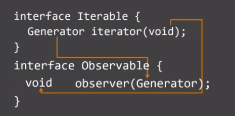

# Modes of Processing

## Parallel

Distribute tasks to external processes. Tasks are completed _simultaneously_.


## Concurrent

Try to handle all tasks at the same time so the work can be _interleaved_ with or without priority.


## Asynchronous

Dispatch asynchronous (I/O) tasks to handlers that execute independently, leaving the program _available_ to accept incoming requests in the interim until tasks are completed.


- _Never Block_: Handling I/O is typically performed via events and continuations. When the program is waiting for an XHR request to return, it can continue to process user input.
- Focus on Network Latency


<br><br><br><br><br><br>


# Asynchronous Web Apps

## Interactive model


Follows the classic request-response pull model.
- Make a request, wait for the request to be fulfilled.
- _Iterable_


## Reactive model

Follows the push model.
- Make the first request by subscribing.
- Be prepared to receive updates.
- _Observable_

Ref: Our food stocking service where you got registered when you accepted the job offer. Snacks are delivered to your floor at regular intervals.

<br><br><br><br><br><br><br><br><br>


# Isomorphic Interfaces


```TS
interface Iterable {
    [Symbol.iterator]() : Iterator;
}
interface Iterator {
    next() : IteratorResult;
}
```

```TS
interface Observable {
    [Symbol.observable]() : Observable;
    subscribe(observer: Observer) : Subscription;
}
interface Observer<T> {
    onNext(value : T);
}
```




<br><br><br><br><br><br><br><br><br>

# Asynchronous Javascript
- Callbacks $$
- Promises $
- Generators
- Async/Await
- Observables
- Async Generators


<br><br><br><br><br><br><br><br><br><br><br><br><br><br><br><br><br>

# Flow Control

| Mode            | One           | Many             |
|:---------------:|:-------------:|:----------------:|
| __Pull (sync)__ | { }           | Iterable         |
| __Push (async)__| Promise       | Observable       |
| __Pull (async)__|               | `Async Iterable` |

- Fetch API implements Readable Streams (for backpressure support)

<br><br>
## ...

### Other streaming considerations:
- Websockets
- Server-side Events API
- HTTP/2 Server Push

### Libraries worth exploring:
- RxJS
- [CSP Channels](http://clojure.com/blog/2013/06/28/clojure-core-async-channels.html)

<br><br><br><br><br><br><br><br><br>
